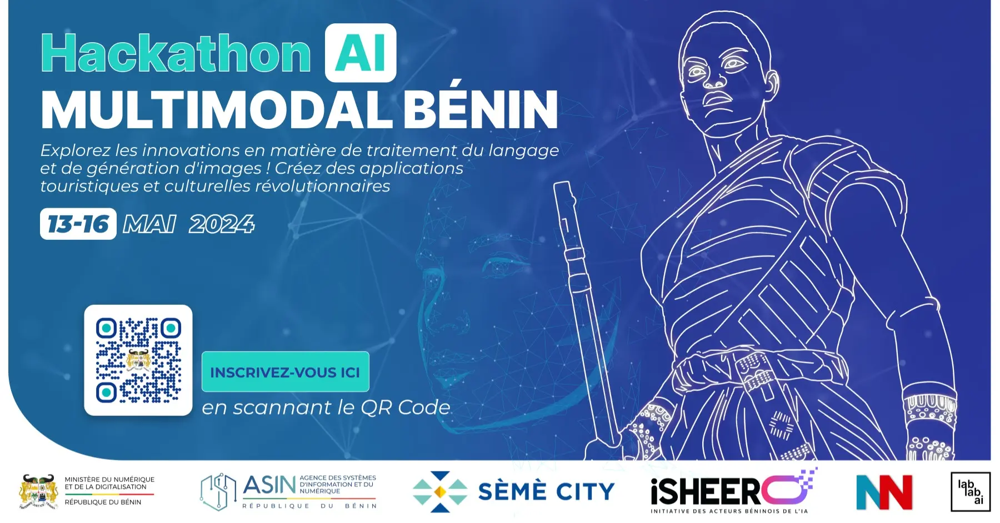
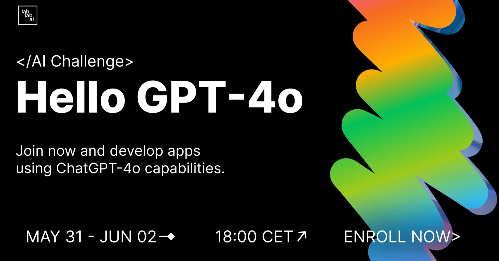
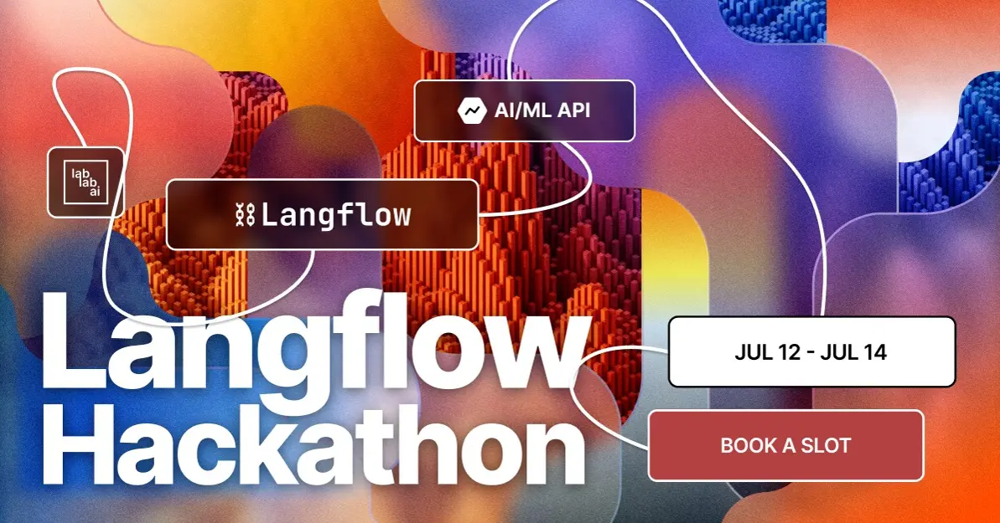
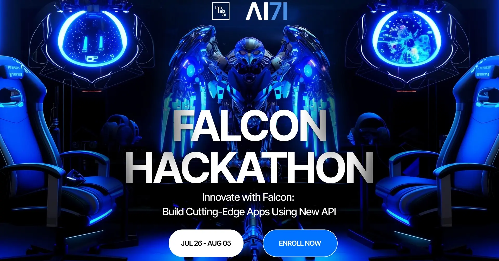

<h3 align="center">
  

</h3>
  
<h3 align="center">
  

    

#

#

# About Me🚀:

<!-- 
  
 -->

- 🔭 I’m currently working on **LeetCode & Python Development**

- 🌱 I’m currently learning **Flutter, Flask, Django**

- 💬 Ask me about **Python, LeetCode, AI/ML**

- 📫 How to reach me **saqlainabid143@gmail.com**

- ⚡ Fun fact **I think I am funny**

# Let's Connect and have a Chat! 💬 

  

# Skill Set🛠:

# GitHub Stats📈:

    

 

     
 

 
    &nbsp; &nbsp;
   
      &nbsp; &nbsp;
   <a href="https://lablab.ai/event/benin-multimodal-ai-hackathon/immersiveculturalexplorer/harmony">
     
      &nbsp; &nbsp;
   
      &nbsp; &nbsp;
   
      &nbsp; &nbsp;
   
      &nbsp; &nbsp;
   
      &nbsp; &nbsp;
   
      &nbsp; &nbsp;
   
  </a>

#

<h3 align="center">
  

</h3>

 

   

 

<h3 align="center">
  

</h3>
