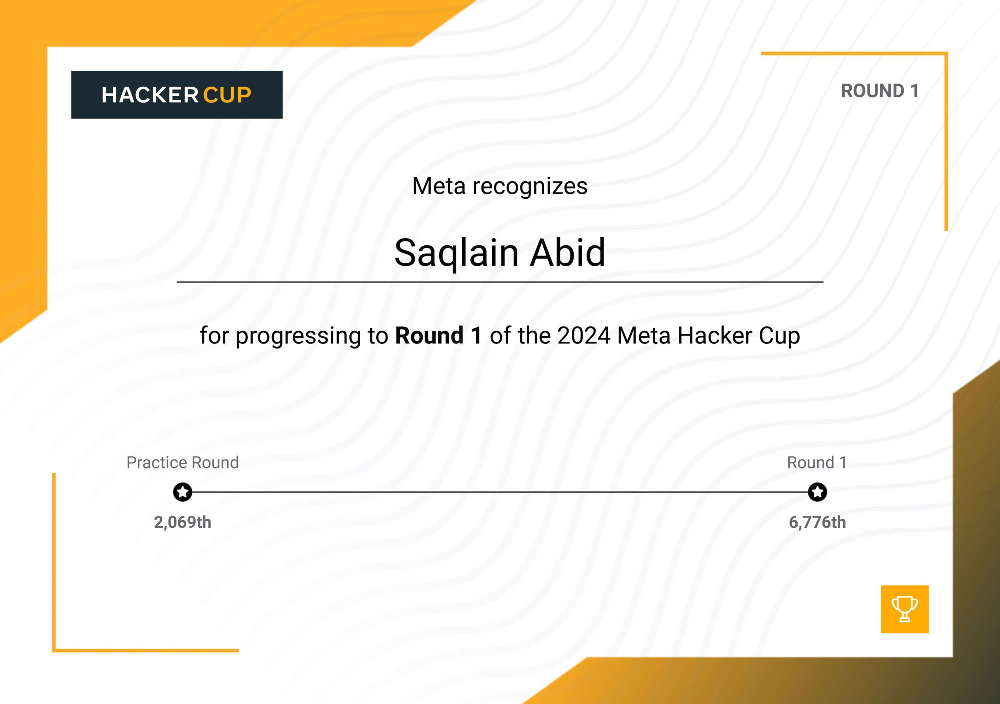
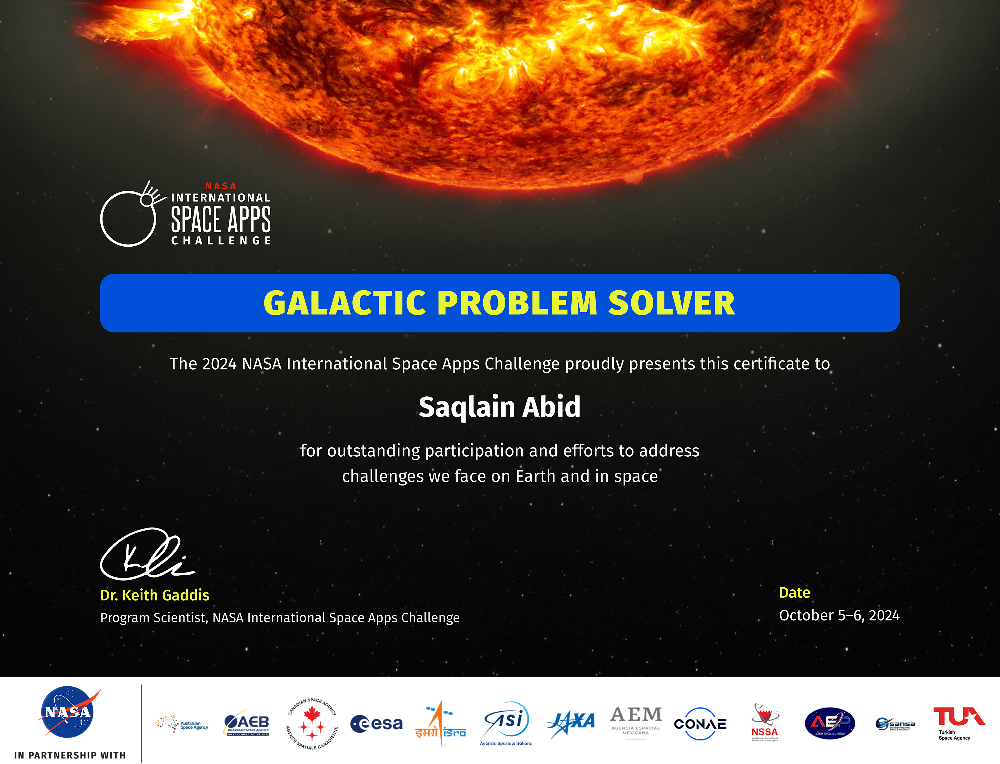

<h3 align="center">
  

</h3>
  
<h3 align="center">
  

#

#

# About Me:

<!-- 
  
 -->

- 🔭 I’m currently working on **LeetCode & Python Development**

- 🌱 I’m currently learning **Flutter, Flask, Django**

- 💬 Ask me about **Python, LeetCode, AI/ML**

- 📫 How to reach me **saqlainabid143@gmail.com**

- ⚡ Fun fact **I think I am funny**

# Let's Connect and have a Chat! 💬 

  

# Skill Set🛠:

# GitHub Stats📈:

    

 

     
 

 
    &nbsp; &nbsp;
   
      &nbsp; &nbsp;
   <a href="https://lablab.ai/event/benin-multimodal-ai-hackathon/immersiveculturalexplorer/harmony">
     
      &nbsp; &nbsp;
   
      &nbsp; &nbsp;
   
      &nbsp; &nbsp;
   
      &nbsp; &nbsp;
   
      &nbsp; &nbsp;
   
      &nbsp; &nbsp;
   
      &nbsp; &nbsp;
   
      &nbsp; &nbsp;
   
      &nbsp; &nbsp;
   
      &nbsp; &nbsp;
   
      &nbsp; &nbsp;
   
      &nbsp; &nbsp;
   

#

# 🏆 LeetCode Badges 🏆

### This repository aims to compile an exhaustive list of LeetCode.com badges.

 

<table>
  <tr>
    <th>Badge</th>
    <th>Name</th>
    <th>How to Earn</th>
    <th>Type</th>
    <th>Earnable</th>
  </tr>
  <tr>
    <td align="center"></td>
    <td align="center">100 Days Badge 2025</td>
    <td align="center">Submit code on 100+ distinct days in 2025</td>
    <td align="center">Annual Medals</td>
    <td align="center">✅</td>
  </tr>
  <tr>
    <td align="center"></td>
    <td align="center">50 Days Badge 2025</td>
    <td align="center">Submit code on 50+ distinct days in 2025</td>
    <td align="center">Annual Medals</td>
    <td align="center">✅</td>
  </tr>
  <tr>
    <td align="center"></td>
    <td align="center">Guardian</td>
    <td align="center">Be in the top 5% of contest-rated users (rating ≥ 1600) by overall contest rating</td>
    <td align="center">Competition Medals</td>
    <td align="center">✅</td>
  </tr>
  <tr>
    <td align="center"></td>
    <td align="center">Knight</td>
    <td align="center">Be in the top 25% of contest-rated users (rating ≥ 1600) by overall contest rating</td>
    <td align="center">Competition Medals</td>
    <td align="center">✅</td>
  </tr>
  <tr>
    <td align="center"></td>
    <td align="center">Aug 2025 Badge</td>
    <td align="center">Submit code daily in August 2025</td>
    <td align="center">Daily Medals</td>
    <td align="center">✅</td>
  </tr>
  <tr>
    <td align="center"></td>
    <td align="center">Introduction to Pandas</td>
    <td align="center">Complete the "Introduction to Pandas" study plan</td>
    <td align="center">Study Plan Medals</td>
    <td align="center">✅</td>
  </tr>
  <tr>
    <td align="center"></td>
    <td align="center">30 Days of Pandas</td>
    <td align="center">Complete the "30 Days of Pandas" study plan</td>
    <td align="center">Study Plan Medals</td>
    <td align="center">✅</td>
  </tr>
  <tr>
    <td align="center"></td>
    <td align="center">30 Days of JavaScript</td>
    <td align="center">Complete the "30 Days of JavaScript" study plan</td>
    <td align="center">Study Plan Medals</td>
    <td align="center">✅</td>
  </tr>
  <tr>
    <td align="center"></td>
    <td align="center">Top Interview 150</td>
    <td align="center">Complete the "Top Interview 150" study plan</td>
    <td align="center">Study Plan Medals</td>
    <td align="center">✅</td>
  </tr>
  <tr>
    <td align="center"></td>
    <td align="center">LeetCode 75</td>
    <td align="center">Complete the "LeetCode 75" study plan</td>
    <td align="center">Study Plan Medals</td>
    <td align="center">✅</td>
  </tr>
  <tr>
    <td align="center"></td>
    <td align="center">Top 100 Liked</td>
    <td align="center">Complete the "Top 100 Liked" study plan</td>
    <td align="center">Study Plan Medals</td>
    <td align="center">✅</td>
  </tr>
  <tr>
    <td align="center"></td>
    <td align="center">SQL 50</td>
    <td align="center">Complete the "SQL 50" study plan</td>
    <td align="center">Study Plan Medals</td>
    <td align="center">✅</td>
  </tr>
  <tr>
    <td align="center"></td>
    <td align="center">Premium Algo 100</td>
    <td align="center">Complete the "Premium Algo 100" study plan</td>
    <td align="center">Study Plan Medals</td>
    <td align="center">✅</td>
  </tr>
  <tr>
    <td align="center"></td>
    <td align="center">Advanced SQL 50</td>
    <td align="center">Complete the "Advanced SQL 50" study plan</td>
    <td align="center">Study Plan Medals</td>
    <td align="center">✅</td>
  </tr>
  <tr>
    <td align="center"></td>
    <td align="center">Programming Skills</td>
    <td align="center">Complete the "Programming Skills" study plan</td>
    <td align="center">Study Plan Medals</td>
    <td align="center">✅</td>
  </tr>
  <tr>
    <td align="center"></td>
    <td align="center">Dynamic Programming</td>
    <td align="center">Complete the "Dynamic Programming" study plan</td>
    <td align="center">Study Plan Medals</td>
    <td align="center">✅</td>
  </tr>
  <tr>
    <td align="center"></td>
    <td align="center">Dynamic Programming Grandmaster</td>
    <td align="center">Complete the "Dynamic Programming Grandmaster" study plan</td>
    <td align="center">Study Plan Medals</td>
    <td align="center">✅</td>
  </tr>
  <tr>
    <td align="center"></td>
    <td align="center">Graph Theory</td>
    <td align="center">Complete the "Graph Theory" study plan</td>
    <td align="center">Study Plan Medals</td>
    <td align="center">✅</td>
  </tr>
  <tr>
    <td align="center"></td>
    <td align="center">Binary Search</td>
    <td align="center">Complete the "Binary Search" study plan</td>
    <td align="center">Study Plan Medals</td>
    <td align="center">✅</td>
  </tr>
  <tr>
    <td align="center"></td>
    <td align="center">2000 Days Badge</td>
    <td align="center">Submit code on 2000+ distinct days</td>
    <td align="center">Submission Days</td>
    <td align="center">✅</td>
  </tr>
  <tr>
    <td align="center"></td>
    <td align="center">1000 Days Badge</td>
    <td align="center">Submit code on 1000+ distinct days</td>
    <td align="center">Submission Days</td>
    <td align="center">✅</td>
  </tr>
  <tr>
    <td align="center"></td>
    <td align="center">500 Days Badge</td>
    <td align="center">Submit code on 500+ distinct days</td>
    <td align="center">Submission Days</td>
    <td align="center">✅</td>
  </tr>
  <tr>
    <td align="center"></td>
    <td align="center">365 Days Badge</td>
    <td align="center">Submit code on 365+ distinct days</td>
    <td align="center">Submission Days</td>
    <td align="center">✅</td>
  </tr>
  <tr>
    <td align="center"></td>
    <td align="center">Annual Badge 2024</td>
    <td align="center">Submit code on 300+ distinct days in 2024</td>
    <td align="center">Annual Medals</td>
    <td align="center">❌</td>
  </tr>
  <tr>
    <td align="center"></td>
    <td align="center">200 Days Badge 2024</td>
    <td align="center">Submit code on 200+ distinct days in 2024</td>
    <td align="center">Annual Medals</td>
    <td align="center">❌</td>
  </tr>
  <tr>
    <td align="center"></td>
    <td align="center">100 Days Badge 2024</td>
    <td align="center">Submit code on 100+ distinct days in 2024</td>
    <td align="center">Annual Medals</td>
    <td align="center">❌</td>
  </tr>
  <tr>
    <td align="center"></td>
    <td align="center">50 Days Badge 2024</td>
    <td align="center">Submit code on 50+ distinct days in 2024</td>
    <td align="center">Annual Medals</td>
    <td align="center">❌</td>
  </tr>
  <tr>
    <td align="center"></td>
    <td align="center">Annual Badge 2023</td>
    <td align="center">Submit code on 300+ distinct days in 2023</td>
    <td align="center">Annual Medals</td>
    <td align="center">❌</td>
  </tr>
  <tr>
    <td align="center"></td>
    <td align="center">100 Days Badge 2023</td>
    <td align="center">Submit code on 100+ distinct days in 2023</td>
    <td align="center">Annual Medals</td>
    <td align="center">❌</td>
  </tr>
  <tr>
    <td align="center"></td>
    <td align="center">50 Days Badge 2023</td>
    <td align="center">Submit code on 50+ distinct days in 2023</td>
    <td align="center">Annual Medals</td>
    <td align="center">❌</td>
  </tr>
  <tr>
    <td align="center"></td>
    <td align="center">Annual Badge 2022</td>
    <td align="center">Submit code on 300+ distinct days in 2022</td>
    <td align="center">Annual Medals</td>
    <td align="center">❌</td>
  </tr>
  <tr>
    <td align="center"></td>
    <td align="center">Annual Medal 2021</td>
    <td align="center">Submit code on 300+ distinct days in 2021</td>
    <td align="center">Annual Medals</td>
    <td align="center">❌</td>
  </tr>
  <tr>
    <td align="center"></td>
    <td align="center">Jan 2025 Badge</td>
    <td align="center">Submit code daily in January 2025</td>
    <td align="center">Daily Medals</td>
    <td align="center">❌</td>
  </tr>
  <tr>
    <td align="center"></td>
    <td align="center">Feb 2025 Badge</td>
    <td align="center">Submit code daily in February 2025</td>
    <td align="center">Daily Medals</td>
    <td align="center">❌</td>
  </tr>
  <tr>
    <td align="center"></td>
    <td align="center">Mar 2025 Badge</td>
    <td align="center">Submit code daily in March 2025</td>
    <td align="center">Daily Medals</td>
    <td align="center">❌</td>
  </tr>
  <tr>
    <td align="center"></td>
    <td align="center">Apr 2025 Badge</td>
    <td align="center">Submit code daily in April 2025</td>
    <td align="center">Daily Medals</td>
    <td align="center">❌</td>
  </tr>
  <tr>
    <td align="center"></td>
    <td align="center">May 2025 Badge</td>
    <td align="center">Submit code daily in May 2025</td>
    <td align="center">Daily Medals</td>
    <td align="center">❌</td>
  </tr>
  <tr>
    <td align="center"></td>
    <td align="center">Jun 2025 Badge</td>
    <td align="center">Submit code daily in June 2025</td>
    <td align="center">Daily Medals</td>
    <td align="center">❌</td>
  </tr>
  <tr>
    <td align="center"></td>
    <td align="center">Jul 2025 Badge</td>
    <td align="center">Submit code daily in July 2025</td>
    <td align="center">Daily Medals</td>
    <td align="center">❌</td>
  </tr>
  <tr>
    <td align="center"></td>
    <td align="center">Sep 2025 Badge</td>
    <td align="center">Submit code daily in September 2025</td>
    <td align="center">Daily Medals</td>
    <td align="center">❌</td>
  </tr>
  <tr>
    <td align="center"></td>
    <td align="center">Oct 2025 Badge</td>
    <td align="center">Submit code daily in October 2025</td>
    <td align="center">Daily Medals</td>
    <td align="center">❌</td>
  </tr>
  <tr>
    <td align="center"></td>
    <td align="center">Dec 2025 Badge</td>
    <td align="center">Submit code daily in December 2025</td>
    <td align="center">Daily Medals</td>
    <td align="center">❌</td>
  </tr>
</table>

#

#

<h3 align="center">
  

</h3>

 

   

 

<h3 align="center">
  

</h3>
